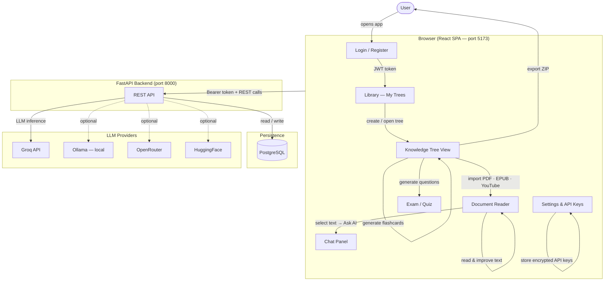

# App Overview — User Perspective

This diagram shows the full journey a user takes through the app, from authentication to using knowledge trees.

## Key user flows

| Flow | Steps |
|------|-------|
| **Import a book** | Library → New Tree → Import PDF/EPUB → background task → chapters + documents appear |
| **Study with AI** | Open document → Improve text → Read improved version → Revert if needed |
| **Chat about content** | Select text in reader → "Ask in chat" → grounded AI answer |
| **Generate flashcards** | Tree view → Generate Flashcards (per chapter) → review cards |
| **Take a quiz** | Tree view → Generate Questions → Start Exam → see score |
| **Export** | Tree view → Export → download ZIP with Markdown + JSON |
