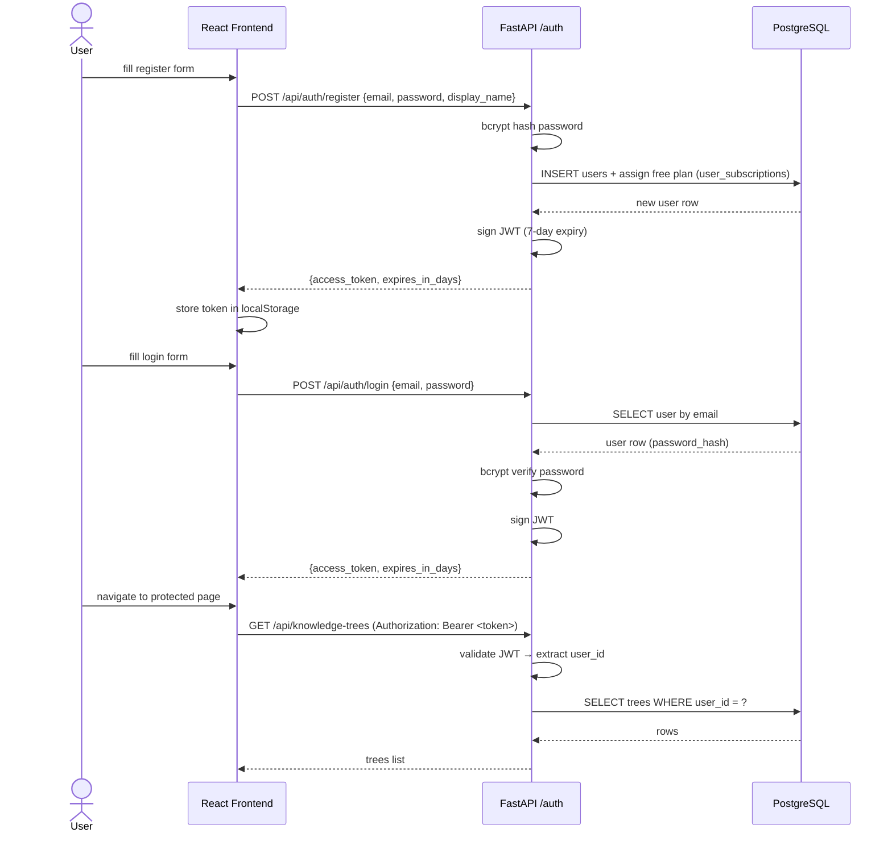
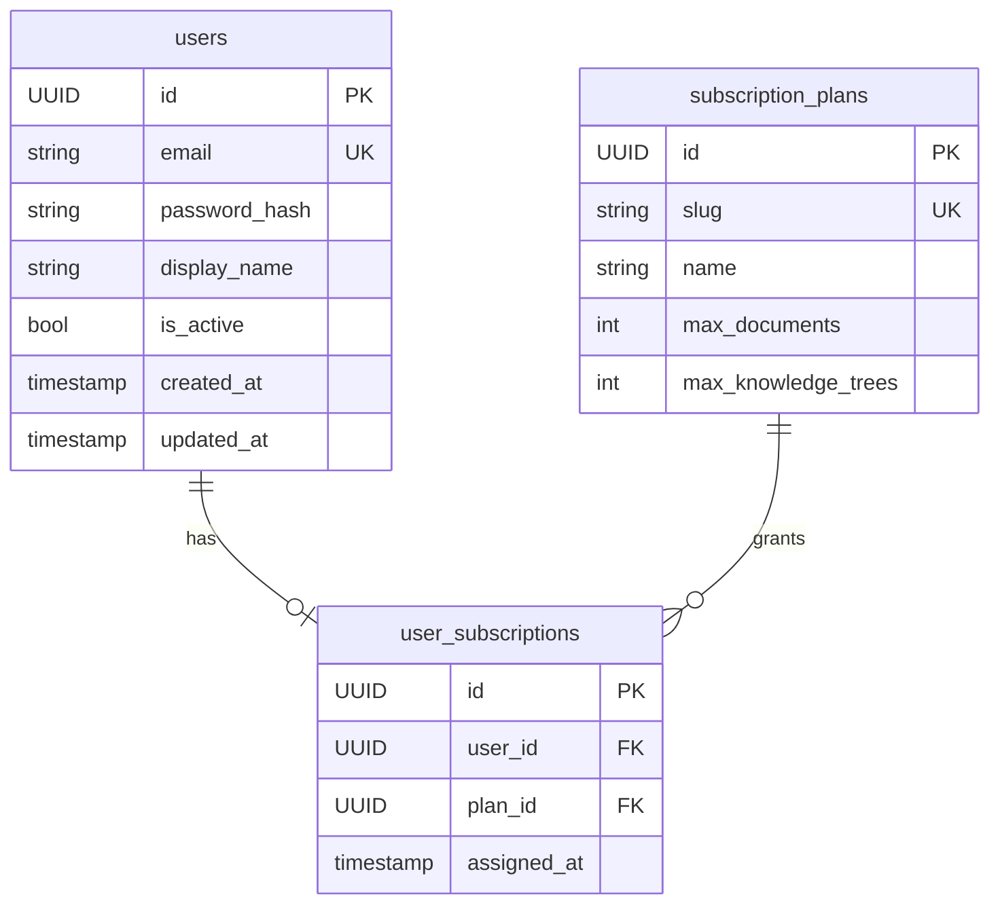
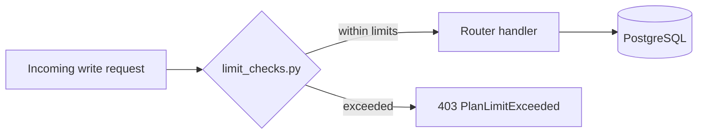

# Authentication Service

Handles user registration, login, JWT issuance, and plan assignment. All knowledge tree endpoints require a valid Bearer token.

## Data model

## Plan limit enforcement

