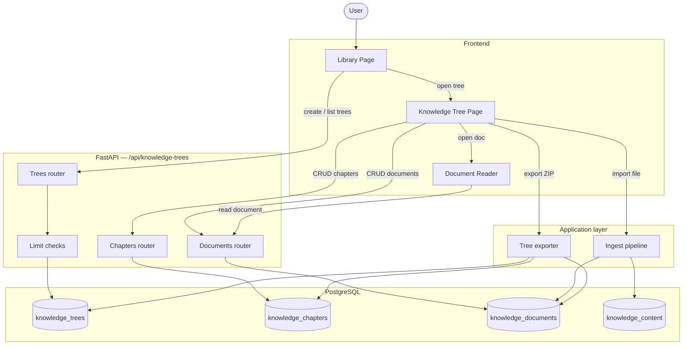
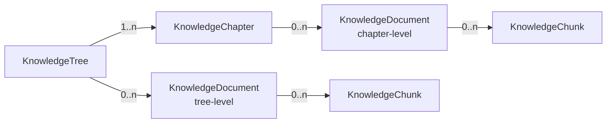
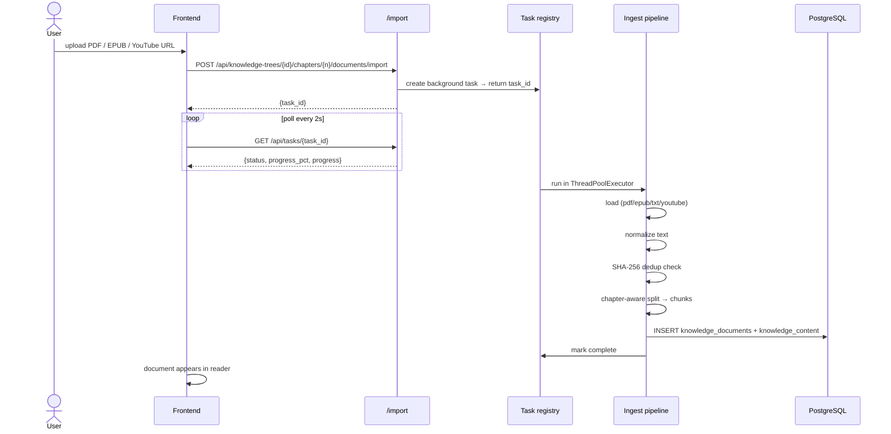
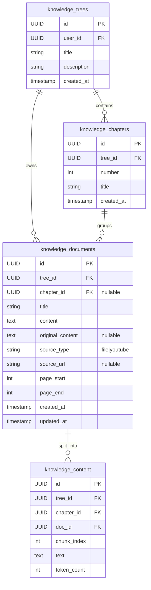

# Knowledge Tree Service

Manages the core domain: trees, chapters, and documents. Documents can be created manually or imported from files/YouTube.

## Domain hierarchy

## Document import pipeline

## Data model

