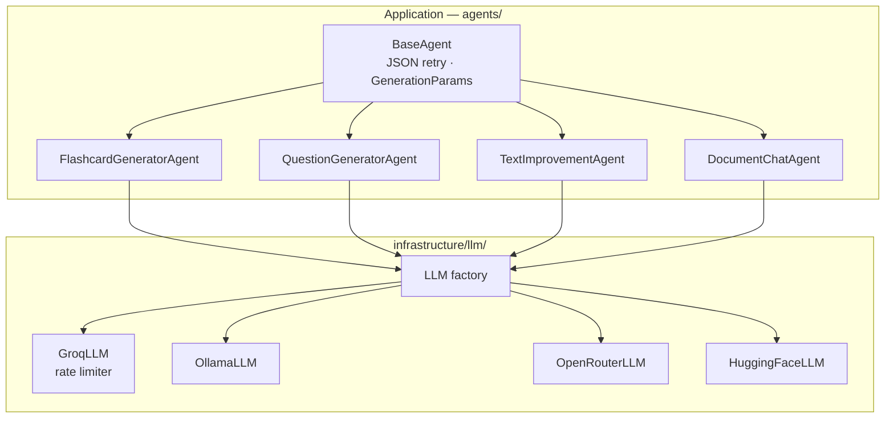
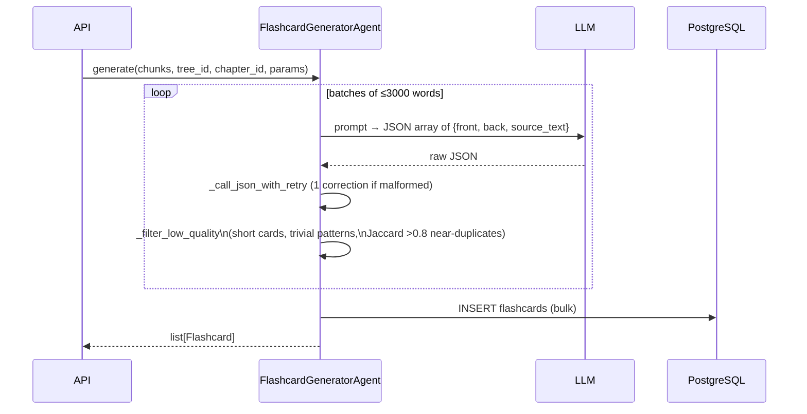
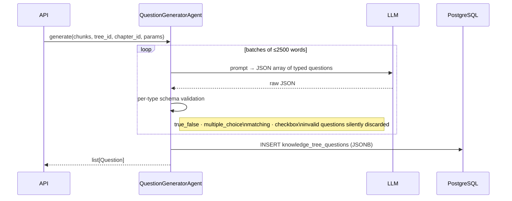
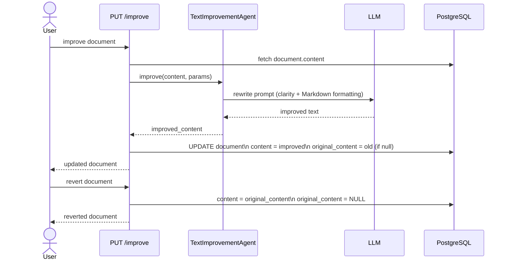
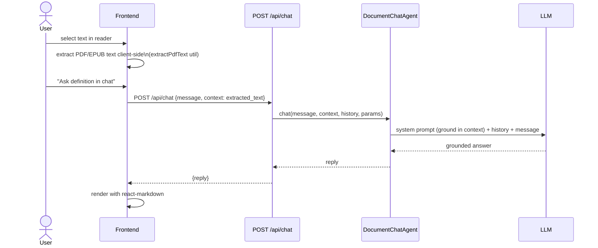
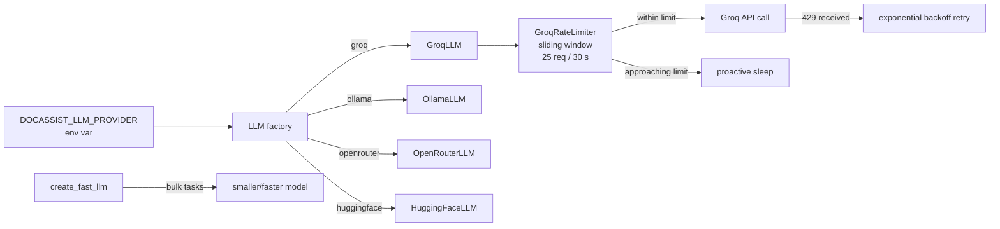

# AI Agents Service

Four specialized agents power the AI features. All share a common base class with JSON-retry logic and accept `GenerationParams` for per-request tuning.

---

## 1 — Flashcard Generator

**Quality filter steps:**
1. Remove cards with front or back shorter than threshold
2. Remove pattern-matched trivial questions ("What is …?" with one-word answers)
3. Remove cards where front overlaps back (Jaccard similarity > 0.8)
4. Remove near-duplicate pairs within the batch

---

## 2 — Question Generator

**Supported question types:**

| Type | Structure |
|------|-----------|
| `true_false` | statement + correct boolean |
| `multiple_choice` | question + options[] + correct_index |
| `matching` | pairs[] of {left, right} |
| `checkbox` | question + options[] + correct_indices[] |

---

## 3 — Text Improvement Agent

---

## 4 — Document Chat Agent

---

## LLM provider selection & rate limiting

| Provider | Main model | Fast model |
|----------|-----------|-----------|
| groq | llama-3.3-70b-versatile | llama-3.1-8b-instant |
| ollama | qwen2.5:14b-instruct | qwen2.5:3b-instruct |
| openrouter | meta-llama/llama-3.3-70b-instruct:free | qwen/qwen2.5-7b-instruct:free |
| huggingface | Qwen/Qwen2.5-72B-Instruct | — |
