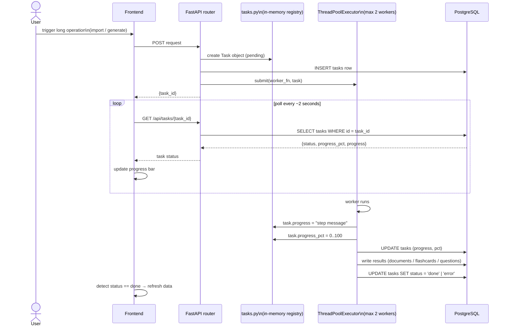
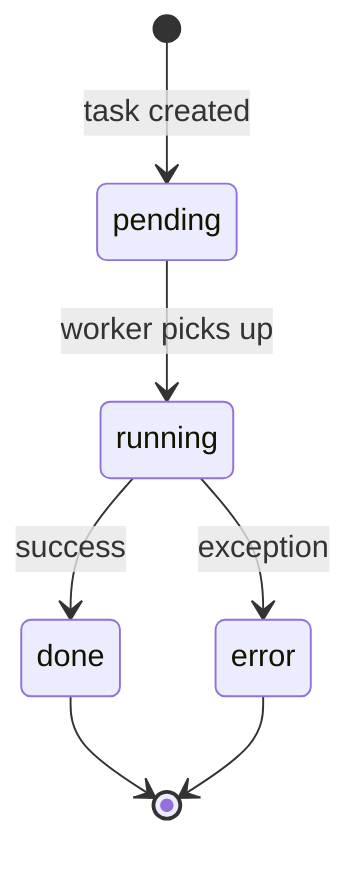
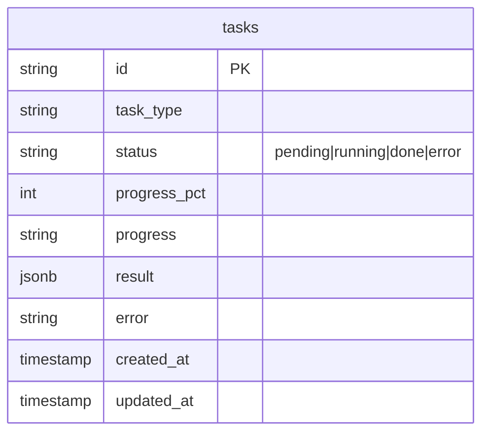

# Task System (Background Processing)

Long-running operations (file import, flashcard generation, question generation) run as background tasks. The frontend polls for status rather than using SSE or WebSockets.

## Task states

## Task types

| Task type | Trigger endpoint | Worker action |
|-----------|-----------------|---------------|
| `document_import` | POST `/chapters/{n}/documents/import` | load → normalize → chunk → INSERT |
| `youtube_import` | POST `/documents/import-youtube` | fetch transcript → INSERT |
| `tree_import` | POST `/knowledge-trees/import` | full file → chapters + documents |
| `flashcard_generation` | POST `/chapters/{n}/flashcards` | chunk → batch LLM → filter → INSERT |
| `question_generation` | POST `/chapters/{n}/questions` | chunk → batch LLM → validate → INSERT |

## Data model

