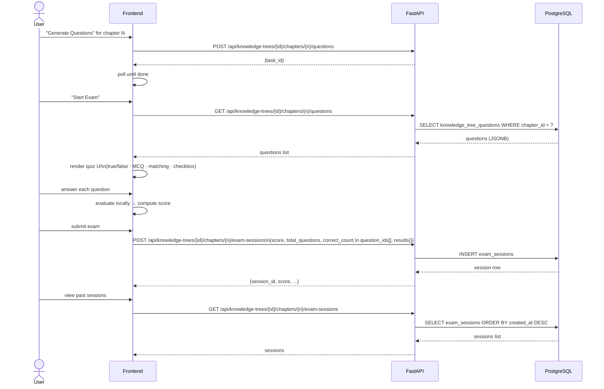
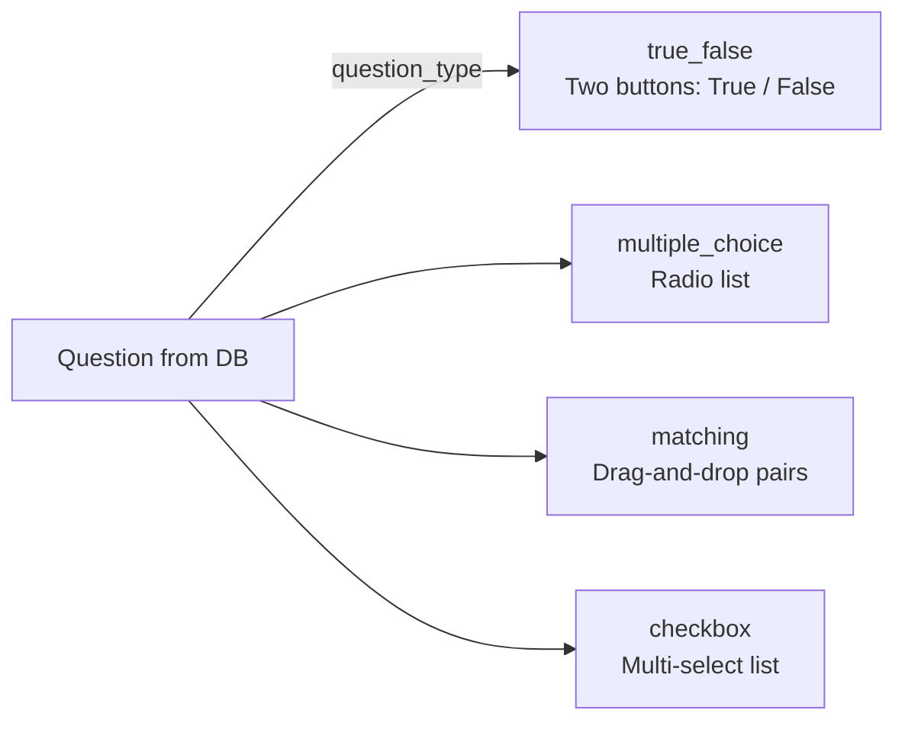
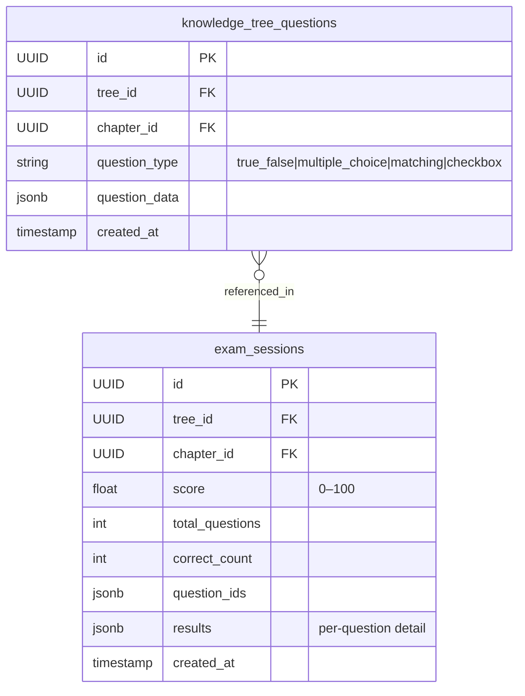

# Exam Sessions Service

Tracks quiz results per chapter. Users generate questions, take an exam in the browser, and the results are persisted for progress tracking.



## Question types rendered in the exam UI



## Data model



## Score calculation

Score is computed client-side before submission:

```
score = (correct_count / total_questions) × 100
```

Per-question results are stored as a JSONB map `{question_id: {correct: bool, user_answer: …}}` for future review.
