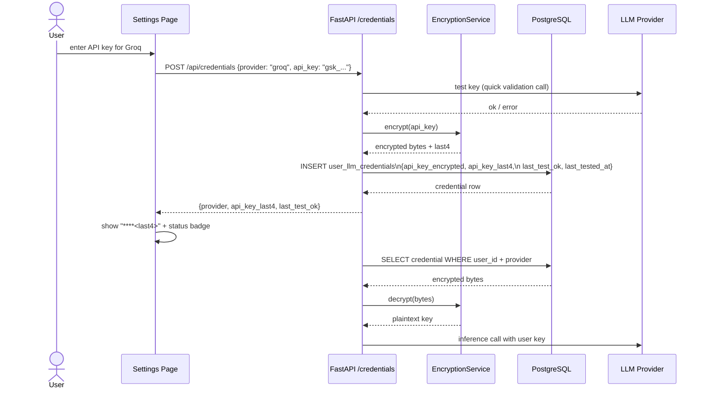
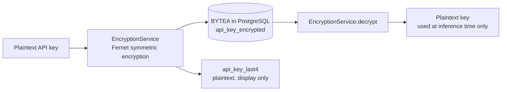
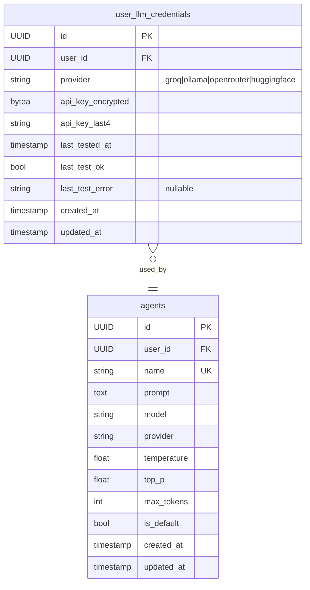
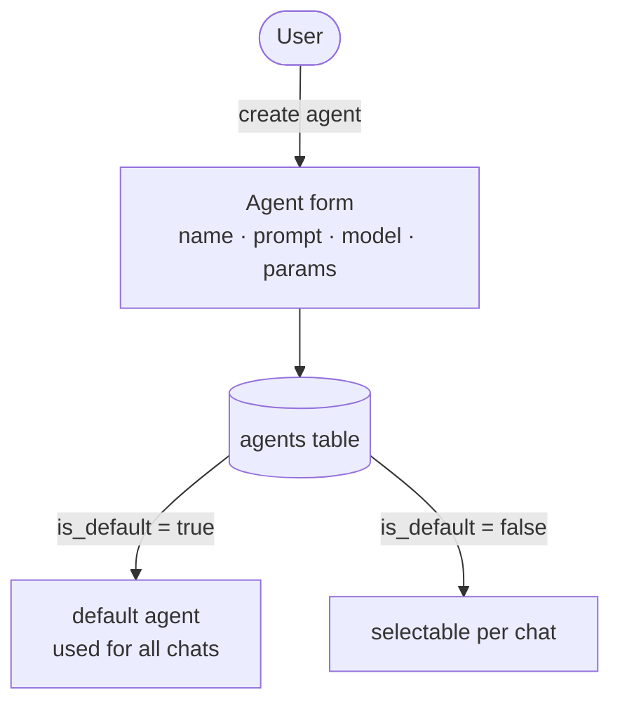

# LLM Credentials Service

Users can supply their own API keys for external LLM providers. Keys are encrypted at rest — only the last 4 characters are stored in plaintext for display purposes.

## Encryption flow

## Data model

## Agent management

Users can also create custom agents with specific system prompts and generation parameters. A default agent is used when no custom one is selected.

