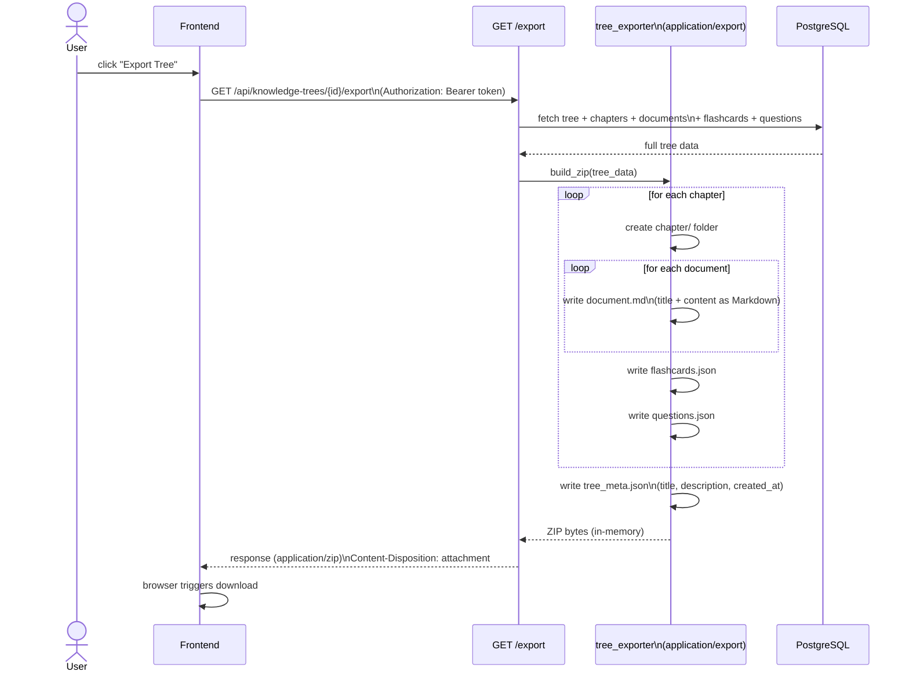

# Export Service

Generates a ZIP archive of an entire knowledge tree — chapters as folders, documents as Markdown files, flashcards and questions as structured JSON.



## ZIP archive structure

```
{tree_title}/
├── tree_meta.json              # title, description, created_at, chapter count
├── chapter_01_{title}/
│   ├── 01_{doc_title}.md       # document content as Markdown
│   ├── 02_{doc_title}.md
│   ├── flashcards.json         # [{front, back, source_text}]
│   └── questions.json          # [{question_type, question_data}]
├── chapter_02_{title}/
│   └── ...
└── (tree-level documents)
    └── {doc_title}.md
```

## Export data included per document

| Field | Included | Notes |
|-------|----------|-------|
| Title | yes | used as filename |
| Content | yes | current version (improved if applicable) |
| Original content | no | not exported |
| Source file name | yes | in document front-matter |
| Source type | yes | `file` or `youtube` |
| Source URL | yes | YouTube URL when applicable |
| Page range | yes | `page_start` / `page_end` |
