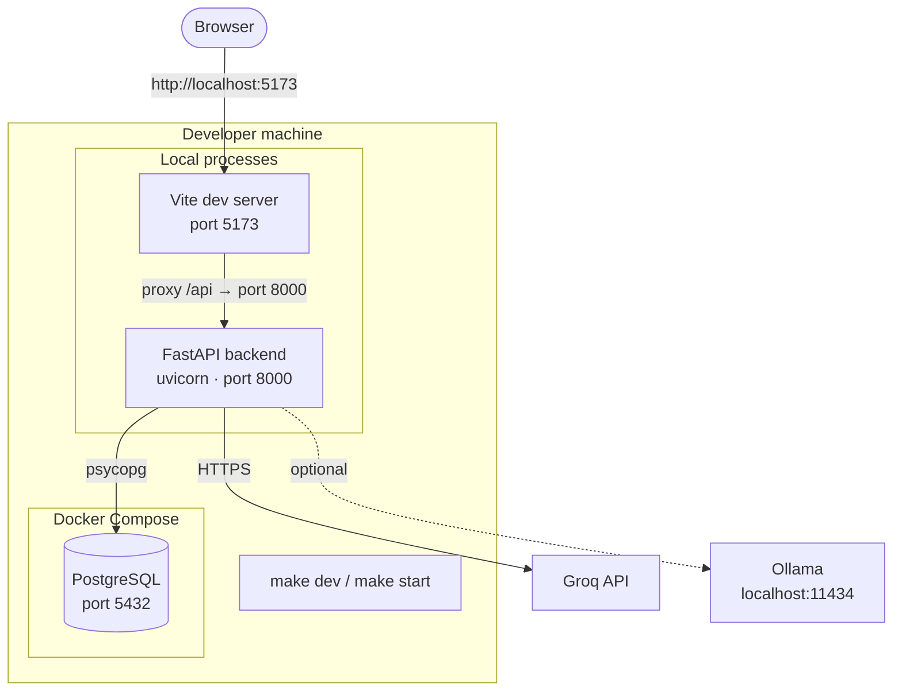
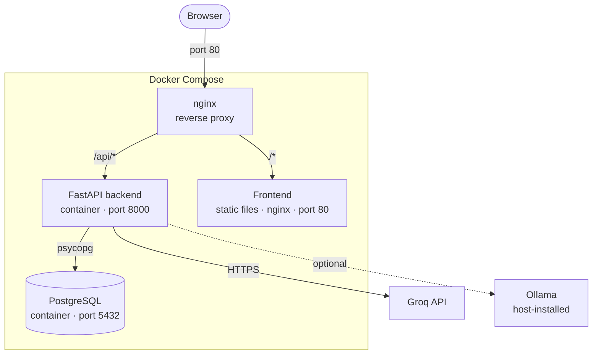
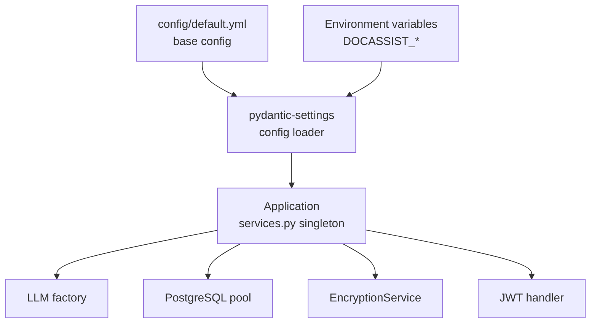
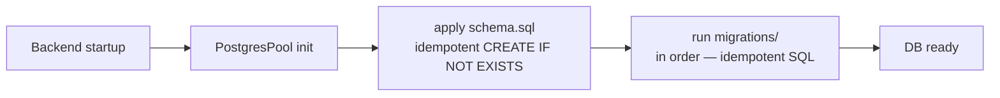

# Infrastructure & Deployment

Shows how all services are wired together in both development and production modes.

## Development setup

## Production / Docker Compose setup

## Service dependency order

```mermaid
flowchart LR
    PG[(PostgreSQL)] -->|healthy| BE[Backend]
    BE -->|schema auto-applied| READY[API ready]
    FE[Frontend] -->|independent build| NGINX[nginx]
    READY --> NGINX
```

## Configuration layers

## Key ports

| Service | Port | Protocol |
|---------|------|----------|
| PostgreSQL | 5432 | TCP |
| FastAPI backend | 8000 | HTTP |
| Vite dev server | 5173 | HTTP |
| nginx (prod) | 80 | HTTP |
| Ollama (optional) | 11434 | HTTP |

## Schema migrations

